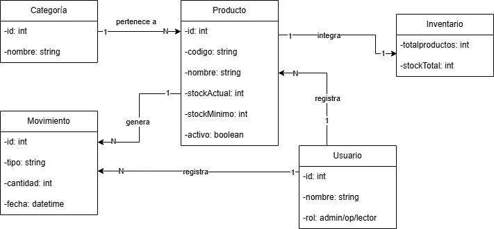
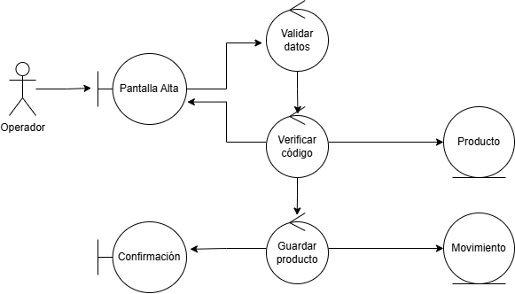
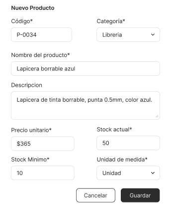
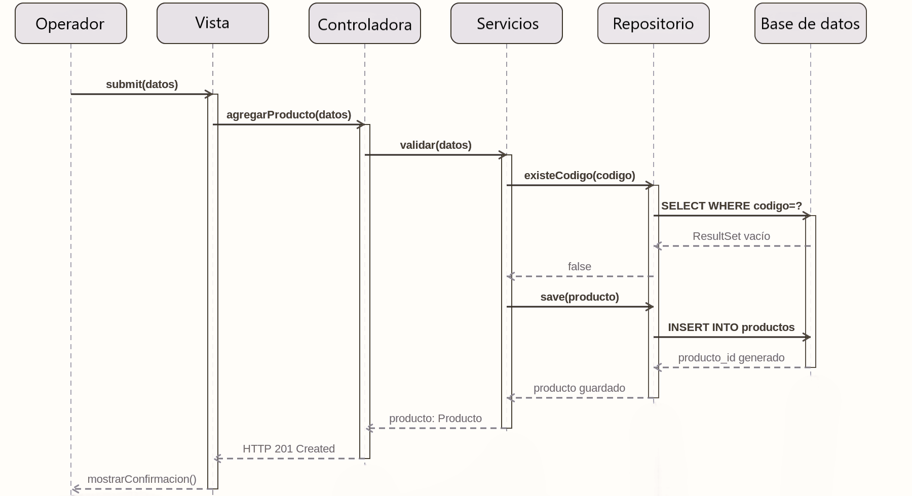
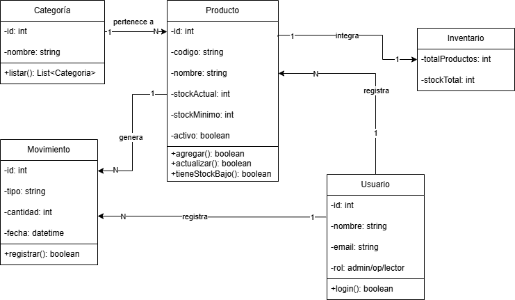

# Ejercicio Nro: 8 y 9

## Enunciado
1. Análisis de Requerimientos: 
    ● Ejercicio 1: Un cliente te solicita una aplicación web para gestionar su 
    inventario. Define los requisitos funcionales y no funcionales del sistema. 
    ● Ejercicio 2: Redacta un caso de uso para la funcionalidad de "Agregar un nuevo 
    producto" en la aplicación web del ejercicio 1. 
2. Diseño del Sistema: 
    ● Ejercicio 3: Elabora un diagrama de flujo de datos para la aplicación web del 
    ejercicio 1. 
    ● Ejercicio 4: Diseña la interfaz de usuario para la pantalla de "Inicio" de la 
    aplicación web del ejercicio 1. 
3. Diseño del Programa: 
    ● Ejercicio 5: Elige una arquitectura adecuada para la aplicación web del ejercicio 
    1 y justifica tu elección. 
    ● Ejercicio 6: Diseña la base de datos para la aplicación web del ejercicio 1. 
4. Diseño: 
Utilizando los siguientes diagrama resuelva los casos de usos de los  
ejercicios 7 y 8:  
        1. Diagrama de Dominio: Identifica las entidades, atributos y relaciones del sistema. 
        2. Diagrama de Robustez: Analiza cómo el sistema responde a diferentes escenarios 
        de uso. 
        3. Prototipo: Crea una versión simplificada del sistema para probar la usabilidad y 
        funcionalidad. 
        4. Diagrama de Secuencia: Describe la interacción entre los diferentes objetos del 
        sistema. 
        5. Diagrama de Clases: Define las clases, sus atributos, métodos y relaciones 
    ● Ejercicio 7: Implementa la funcionalidad de "Agregar un nuevo producto" en la 
    aplicación web del ejercicio 1 utilizando el lenguaje de programación de tu 
    preferencia. 
    ● Ejercicio 8: Implementa la lógica de negocio para la funcionalidad de "Agregar 
    un nuevo producto" en la aplicación web del ejercicio 1. 
5. Pruebas: 
    ● Ejercicio 9: Define un conjunto de pruebas unitarias para la funcionalidad de 
    "Agregar un nuevo producto" en la aplicación web del ejercicio 1. 
    ● Ejercicio 10: Ejecuta pruebas de integración para la funcionalidad de "Agregar 
    un nuevo producto" en la aplicación web del ejercicio 1. 
6. Despliegue del Programa: 
    ● Ejercicio 11: Definir un plan de despliegue para la aplicación web del ejercicio 1. 
    ● Ejercicio 12: Despliega la aplicación web del ejercicio 1 en un servidor de 
    producción. 
7. Mantenimiento: 
    ● Ejercicio 13: Definir un plan de mantenimiento para la aplicación web del 
    ejercicio 1. 
    ● Ejercicio 14: Implementa una corrección de errores para un problema detectado 
    en la aplicación web del ejercicio 1. 
8. Nos preparamos para nuevos retos - 
    ● Ejercicio 15: Arme un equipo de trabajo y defina los roles para realizar los 
    ejercicios anteriores para un futuro dominio de aplicación relacionado con 
    inteligencia artificial generatica. 

## Resolución
1.  Análisis de Requerimientos
EJERCICIO 1:
Requisitos Funcionales:
-Agregar, editar y eliminar productos del inventario.
-Consultar el stock actual de cada producto.
-Registrar entradas y salidas de mercadería.
-Generar alertas cuando el stock de un producto está por debajo de un mínimo configurable.
-Filtrar y buscar productos por categoría, nombre o código.
-Generar reportes de inventario comostock actual y movimientos históricos.
-Gestionar usuarios con distintos roles (administrador, operador, solo lectura).

Requisitos No Funcionales:
-Rendimiento: Las consultas de stock deben responder en menos de 2 segundos.
-Seguridad: Autenticación con usuario y contraseña. Las acciones críticas (eliminación) requieren confirmación y quedan auditadas.
-Usabilidad: La interfaz debe ser intuitiva y operable sin capacitación extensa.
-Disponibilidad: El sistema debe estar disponible al menos el 99% del tiempo en horario laboral.
-Escalabilidad: Debe poder manejar hasta 10.000 productos sin degradación de performance.
-Mantenibilidad: El código debe estar documentado y organizado para facilitar futuras modificaciones.

EJERCICIO 2:
Caso de uso: "Agregar un nuevo producto"
Nombre del caso de uso: Agregar nuevo producto
Actor principal: Operador / Administrador
Precondición: El usuario está autenticado en el sistema con permisos de escritura.
Flujo principal:
    -El usuario accede a la sección "Productos" y selecciona "Agregar producto".
    -El sistema muestra el formulario de alta con los campos: nombre, código, categoría, descripción, precio unitario, stock inicial, stock mínimo.
    -El usuario completa los campos y hace clic en "Guardar".
    -El sistema valida que todos los campos obligatorios estén completos y que el código de producto no exista ya.
    -El sistema guarda el nuevo producto en la base de datos.
    -El sistema muestra un mensaje de confirmación: "Producto agregado exitosamente".
Flujos alternativos:
    -Si el código ya existe, el sistema muestra un error: "Ya existe un producto con ese código".
    -Si faltan campos obligatorios, el sistema resalta los campos vacíos y no permite guardar.
Postcondición: El nuevo producto queda disponible en el inventario.

2.  Diseño del Sistema
EJERCICIO 3:

EJERCICIO 4:

https://www.figma.com/make/ITFDD91NvhvxSbn4xadNx1/Dashboard-design-specifications?fullscreen=1&t=bhiMbNyBf71qb1yu-1

3. Diseño del Programa
EJERCICIO 5:
Elegí la arquitectura MVC (Modelo - Vista - Controlador) en 3 capas porque se adapta bien al tipo de sistema que se pide desarrollar, ya que cuenta con una interfaz web y varias entidades relacionadas.
En el modelo se representan las entidades principales, como usuarios, productos o movimientos, y se encarga del acceso a los datos. Esto me permite, por ejemplo, cambiar la base de datos sin afectar otras partes del sistema.
La vista corresponde a la parte visual (HTML y CSS), es decir, lo que ve el usuario. Al estar separada, puedo modificar el diseño sin alterar la lógica del sistema.
El controlador actúa como intermediario, recibiendo las solicitudes del usuario y coordinando la respuesta adecuada entre el modelo y la vista.
Yo creo que esta arquitectura es adecuada porque me permite mantener el sistema organizado, facilitar su mantenimiento y realizar pruebas sobre cada parte de forma independiente.
EJERCICIO 6

4. Diseño

EJERCICIO 7 y 8
Implementación de la lógica de negocio en Python:
def agregar_producto(codigo, nombre, categoria_id, descripcion,
                     precio, stock_inicial, stock_minimo, usuario_id):
    # Validación de campos obligatorios
    if not codigo or not nombre or precio <= 0 or stock_inicial < 0:
        raise ValueError('Datos inválidos: campos obligatorios incompletos.')
    # Verificar que el código no exista ya
    if producto_repository.existe_codigo(codigo):
        raise ValueError(f'Ya existe un producto con el código {codigo}.')
    # Crear el nuevo producto
    nuevo_producto = Producto(
        codigo=codigo, nombre=nombre, categoria_id=categoria_id,
        descripcion=descripcion, precio_unitario=precio,
        stock_actual=stock_inicial, stock_minimo=stock_minimo, activo=True
    )
    # Persistir en base de datos
    producto_repository.guardar(nuevo_producto)
    # Registrar movimiento de entrada inicial
    movimiento = Movimiento(
        producto_id=nuevo_producto.id, tipo='entrada',
        cantidad=stock_inicial, usuario_id=usuario_id
    )
    movimiento_repository.registrar(movimiento)
    # Verificar si nació con stock bajo
    if nuevo_producto.stock_actual <= nuevo_producto.stock_minimo:
        alerta_service.notificar_stock_bajo(nuevo_producto)
    return nuevo_producto
5. Pruebas
EJERCICIO 9
Pruebas unitarias para la funcionalidad 'Agregar producto':
def test_agregar_producto_exitoso():
    resultado = agregar_producto('P001','Lapicera',1,'',150.0,50,10,1)
    assert resultado.codigo == 'P001'
    assert resultado.stock_actual == 50
def test_codigo_duplicado_lanza_error():
    agregar_producto('P001','Lapicera',1,'',150.0,50,10,1)
    with pytest.raises(ValueError, match='Ya existe un producto'):
        agregar_producto('P001','Otra cosa',1,'',200.0,30,5,1)
def test_precio_negativo_lanza_error():
    with pytest.raises(ValueError, match='Datos inválidos'):
        agregar_producto('P002','Cuaderno',1,'',-50.0,20,5,1)
def test_nombre_vacio_lanza_error():
    with pytest.raises(ValueError, match='Datos inválidos'):
        agregar_producto('P003','',1,'',100.0,10,2,1)
def test_stock_inicial_menor_a_minimo_genera_alerta():
    resultado = agregar_producto('P004','Goma',1,'',30.0,2,10,1)
    assert alerta_service.fue_notificado(resultado.id) == True
EJERCICIO 10
def test_integracion_agregar_y_consultar():
    respuesta = cliente_http.post('/api/productos', json={
        'codigo': 'INT001', 'nombre': 'Resma A4',
        'categoria_id': 1, 'precio': 800.0,
        'stock_inicial': 100, 'stock_minimo': 20
    })
    assert respuesta.status_code == 201
    producto = producto_repository.buscar_por_codigo('INT001')
    assert producto is not None
    movimientos = movimiento_repository.listar_por_producto(producto.id)
    assert movimientos[0].tipo == 'entrada'
def test_integracion_codigo_duplicado_devuelve_error_400():
    cliente_http.post('/api/productos', json={'codigo': 'INT002', ...})
    respuesta = cliente_http.post('/api/productos', json={'codigo': 'INT002', ...})
    assert respuesta.status_code == 400
    assert 'Ya existe' in respuesta.json()['mensaje']
6. Despliegue del Programa
EJERCICIO 11
Entornos:
•	Desarrollo: entorno local del equipo, con datos de prueba.
•	Staging: servidor de pre-producción con datos similares a los reales.
•	Producción: servidor final accesible por el cliente.
Pasos del plan de despliegue:
1) Ejecutar todas las pruebas unitarias e integración. Si alguna falla, no se despliega.
2) Hacer backup completo de la base de datos de producción.
3) Ejecutar scripts de migración de base de datos (nuevas tablas o columnas).
4) Subir el nuevo código al servidor mediante acciones de GitHub o de forma manual.
5) Reiniciar el servidor de aplicaciones.
6) Verificar que la aplicación responde correctamente.
7) Notificar al cliente que el sistema está actualizado.
EJERCICIO 12
Comandos de despliegue en el servidor de producción:
- Actualizar código
git pull origin main
- Instalar dependencias
pip install -r requirements.txt
- Ejecutar migraciones de base de datos
python manage.py migrate
- Recolectar archivos estáticos
python manage.py collectstatic --noinput
- Reiniciar servidor de aplicaciones
sudo systemctl restart gunicorn
- Verificar que el servicio está activo
sudo systemctl status gunicorn
7. Mantenimiento
EJERCICIO 13
Mantenimiento correctivo:
- Ante un bug reportado: se abre un issue, se reproduce el error, se corrige, se testea y se despliega un hotfix.
Mantenimiento preventivo:
- Revisión mensual de logs de errores.
- Monitoreo de performance del servidor.
- Actualización de dependencias con vulnerabilidades de seguridad.
Mantenimiento evolutivo:
- Nuevas funcionalidades se planifican en versiones, siguiendo el mismo proceso en cascada.
Backup y monitoreo:
- Backup automático diario de la base de datos, guardado en almacenamiento externo.
- Alertas automáticas ante caídas del servidor o errores 500 repetidos.
EJERCICIO 14
Bug detectado: Al agregar un producto con stock inicial igual al stock mínimo, no se genera la alerta de stock bajo.
Causa raíz: El código original usaba el operador < en lugar de <=:
- Código con bug
if nuevo_producto.stock_actual < nuevo_producto.stock_minimo:
- Código corregido
if nuevo_producto.stock_actual <= nuevo_producto.stock_minimo:
Pasos de corrección:
1)	Identificar el bug mediante el test unitario correspondiente.
2) Corregir la condición en el servicio agregar_producto.
3)	Ejecutar la suite de tests completa para verificar que no se rompió nada más.
4)	Hacer commit con el mensaje: 'fix: corrige condición de alerta de stock mínimo'.
5)	Desplegar a producción siguiendo el plan del Ejercicio 11.
8. Nos preparamos para nuevos retos 
EJERCICIO 15
Sistema web de gestión y evaluación de prompts para modelos de IA generativa. Permite a equipos guardar, versionar y comparar prompts con sus resultados.
Product Owner: Define qué funcionalidades tienen más valor. Prioriza el backlog.
Analista de Requerimientos: Relevamiento con el cliente, redacción de casos de uso y requisitos.
Arquitecto de Software: Define la arquitectura del sistema y toma decisiones técnicas clave.
Desarrollador Backend: Implementa lógica de negocio, API REST, integración con APIs de IA.
Desarrollador Frontend: Construye la interfaz: formularios, visualización de respuestas de IA.
DBA/Diseñador de BD: Diseña y mantiene la base de datos de prompts y resultados.
Tester/QA: Define y ejecuta pruebas unitarias, de integración y de aceptación.
DevOps: Configura CI/CD, entornos de despliegue, monitoreo y backups.
Este equipo aplica los mismos roles y fases de la metodología en cascada al nuevo dominio de inteligencia artificial generativa, adaptando cada entregable al contexto de gestión de prompts y modelos de lenguaje.